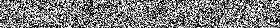

# DiffusionModel
Implement Diffusion Model (Denoising Diffusion Probabilistic Models) only by Pytorch. It is the clearest/simplest (Within 300 lines) but complete implementation of DDPM. Unlike traditional implementation which use U-Net, this implementation only use MLP. 

Two datasets are supported: 2D data and MNIST.

## 2D data
We generate a [heart](https://mathworld.wolfram.com/HeartCurve.html) like two dimensional points. Each training sample is just a 2D point (x, y). One important [preprocessing](https://arxiv.org/abs/2006.10739) step is to convert each coordinate to sinusoidal embeddings before feeding to the model. 

```bash
python dm.py
```
This command train 2d diffusion model (whthin 3 minutes in cpu), show forward and reverse diffusion process by a bunch of 2d points. *Note that the training sample is not an image of 2d points, but a single 2d point.*


## MNIST
For diffusion image generation, the prevalent model sturcture is U-Net or [Diffusion Transformer](https://arxiv.org/abs/2212.09748) (Sora is built on). **This repo provides a unique educational implementation of MLP based diffusion model for image generation.** 

```bash
python dm.py --device cuda --learning_rate 1e-3 --dataset mnist --train_batch_size 128 --eval_batch_size 10 --num_epochs 200  --num_timesteps 1000 --embedding_size 100 --hidden_size 2048 --hidden_layers 5 --show_image_step 50
```
The command train MLP diffusion model on MNIST (within 3 minutes in gpu), show reverse diffusion process of 10 mnist images generating from gaussian noise. 




# Reference Implementation
- https://github.com/awjuliani/pytorch-diffusion
- https://github.com/tanelp/tiny-diffusion/

# Reference Paper
- [Denoising Diffusion Probabilistic Models](https://arxiv.org/abs/2006.11239)
- [Deep Unsupervised Learning using Nonequilibrium Thermodynamics](https://arxiv.org/abs/1503.03585)
