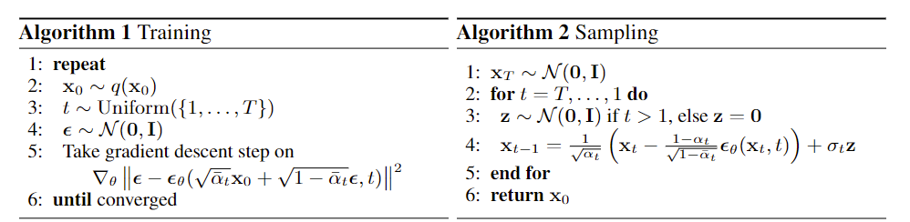

## 1. 背景介绍

生成模型是机器学习领域中一个重要的研究方向，其目标是学习数据的概率分布，并能够生成新的、与训练数据同分布的数据样本。近年来，生成模型在图像生成、视频生成、文本创作、蛋白质发现等领域取得了显著的成果，并展现出巨大的应用潜力。

传统的生成模型（自回归模型（Autoregressive ）在另外一篇文章介绍），如变分自编码器（VAE）和生成对抗网络（GAN），各有其优缺点。VAE 通常会生成较为模糊的图像，而 GAN 则面临着训练不稳定和模式坍塌等问题。

在这样的背景下，Diffusion Model 应运而生。它基于一个优雅的思想：**通过逐渐添加高斯噪声将数据转换为近似纯噪声，然后学习逆转这个过程，将噪声逐步恢复成新的数据样本。**

Diffusion Model 的优势在于：

* **生成质量高：** Diffusion Model 在图像生成方面表现出色，能够生成高质量、高分辨率的图像。
* **训练稳定性好：** 相比 GAN，Diffusion Model 的训练过程更加稳定，不容易出现模式坍塌等问题。
* **理论基础扎实：** Diffusion Model 的理论基础来源于非平衡热力学，具有良好的理论特性。

**Diffusion Model 的发展历程可以追溯到 2015 年的 “Deep Unsupervised Learning using Nonequilibrium Thermodynamics” 论文。** 该论文提出了基于扩散过程的生成模型框架，但真正引起广泛关注的是 “Denoising Diffusion Probabilistic Models” 论文的发表，该论文提出了一种非常简洁的 Diffusion 算法，并通过实验证明了其在图像生成方面的优越性。

**近年来，Diffusion Model 发展迅速，涌现出许多改进算法和应用场景，例如 Stable Diffusion系列、DALL-E 系列、SoRA系列 等。** 这些模型的成功进一步证明了 Diffusion Model 的强大能力。

接下来，我们将简单描述 Diffusion Model 的原理，并结合代码进行深入分析。
## 2. Diffusion Model 简要原理

Diffusion Model 的核心思想可以概括为两个阶段 （*公式推导* 部分会详细论述所有公式的来龙去脉）：

**1. 前向扩散 (Forward Diffusion Process):**  在这个阶段，我们逐步向原始数据中添加高斯噪声，使其最终变成近似纯噪声。这个过程可以看作是一个马尔可夫链，每一步都只依赖于前一步的状态。

假设  $x_0$  表示原始数据，  $x_t$  表示在时间步  $t$  添加噪声后的数据，  $T$  表示总的时间步数。那么前向扩散过程可以用如下公式表示：

$$
q(x_t|x_{t-1}) = \mathcal{N}(x_t; \sqrt{1 - \beta_t} x_{t-1}, \beta_t I)
$$

其中，$\beta_t$  是时间步  $t$  的噪声方差，通常是一个单调递增的序列。 $\mathcal{N}(x; \mu, \Sigma)$ 表示均值为 $\mu$，方差为 $\Sigma$ 的高斯分布。

上面的公式可以等价的写成如下形式 (记 $\alpha_t = 1 - \beta_t$)：
$$
x_t = \sqrt{\alpha_t} x_{t-1} + \sqrt{1 - \alpha_t} \epsilon_t
$$

**这个公式直接表达了向样本$x_{t-1}$添加噪声的$\epsilon_t$过程，通过递推运算我们可以得到任意时间步 $t$ 的  $x_t$：**

$$
x_t = \sqrt{\bar\alpha_t} x_{0}  + \sqrt{1 - \bar\alpha_t} \epsilon
$$

其中，$\bar{\alpha}_t = \prod_{s=1}^{t} \alpha_s$， $\epsilon$以及$\epsilon_t$服从标准高斯分布。

**2. 反向扩散 (Reverse Diffusion Process):**  在这个阶段，我们学习一个模型来逆转前向扩散过程，将纯噪声逐步恢复成新的数据样本：

$$
p_\theta(x_{t-1}|x_t) = \mathcal{N}(x_{t-1}; \mu_\theta(x_t, t), \Sigma_\theta(x_t, t))
$$

其中，$\mu_\theta(x_t, t)$ 和 $\Sigma_\theta(x_t, t)$  是模型的预测，分别表示在时间步  $t$  的均值和方差，DDPM这篇文章简单起见另$\Sigma_\theta(x_t,t) = \sigma^2_t I$为常量，其中$\sigma_t^2 = \beta_t$或者$\sigma_t^2 = \tilde\beta_t =  \frac{1 - \bar{\alpha}_{t-1}}{1 - \bar{\alpha}_t}\beta_t$ (本文的实现)。

**训练目标是使得反向扩散过程生成的样本分布尽可能接近原始数据的分布。** 根据后续的推导，另:
$$
\mu_\theta(x_t,t) = \frac{1}{\sqrt{\alpha_t}}(x_t-\frac{1-\alpha_t}{\sqrt{1-\bar\alpha_t}}\epsilon_\theta(x_t,t))
$$
训练目标简化为优化模型参数  $\theta$，使模型预测添加至样本的噪声：

$$
L_\text{simple}(\theta) = \mathbb{E}_{t,x_0, \epsilon} \left[ \| \epsilon - \epsilon_\theta(\sqrt{\bar\alpha_t} x_{0}  + \sqrt{1 - \bar\alpha_t} \epsilon, t) \|^2 \right]
$$

其中，$\epsilon$ 是前向扩散过程中添加的噪声，$\epsilon_\theta(\sqrt{\bar\alpha_t} x_{0}  + \sqrt{1 - \bar\alpha_t} \epsilon, t) =\epsilon_\theta(x_t, t)$ 是模型预测的噪声。

训练完毕后，我们可以采样$ x_{t-1} \sim p_\theta(x_{t-1}|x_t)$, 即：
$$
x_{t-1} = \frac{1}{\sqrt{\alpha_t}}(x_t-\frac{1-\alpha_t}{\sqrt{1-\bar\alpha_t}}\epsilon_\theta(x_t,t))+\sigma_tz
$$

其中，$z$是标准高斯分布。根据上面的公式，我们即可得到DDPM的训练及采样算法：

在下一节中，我们将结合代码来详细讲解 Diffusion Model 的实现细节。

